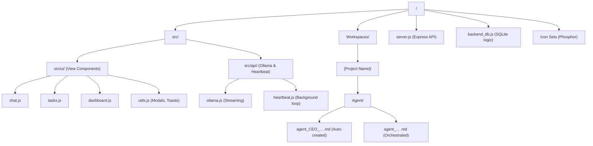
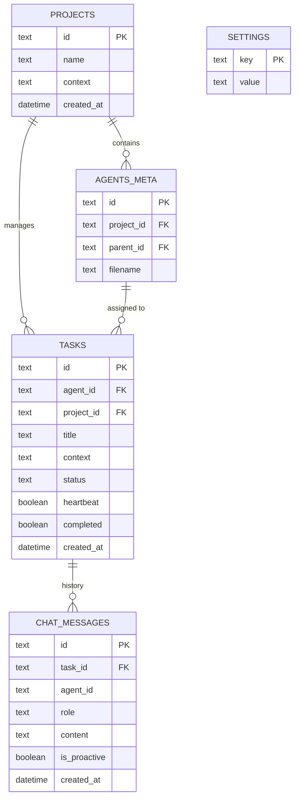

# OllamaClip - Architecture & Technical Documentation

This document provides a technical overview of the OllamaClip architecture, including the directory structure and the database schema.

## 📁 Directory Structure

OllamaClip follows a clean, modular structure where the UI is strictly separated from the persistence bridge and autonomous business logic.

## 🗄️ Database Schema (SQLite)

The persistence layer uses SQLite to manage projects, tasks, and chat history. Deletions follow a cascading pattern to ensure no orphan messages remain.

## 🚀 Key Flow: Agent Deletion Cascade

1. **User deletes Project**:
    - Purges all `tasks` of the project.
    - Purges all `chat_messages` of those tasks.
    - Purges all `agents_meta` links.
    - Physically deletes the `Workspaces/[ProjectName]` directory.

2. **User deletes Task**:
    - Purges the `task` from the DB.
    - Purges all `chat_messages` linked to that `task_id`.

### 🏢 AI Orchestration & Logic
1. **Model Management (V16)**:
    - **Selection**: `getBestAvailableModel()` in `backend_db.js` ranks models based on a preference list (`llama3.1`, `llama3`, `mistral`, `phi3`) and falls back to a size-safe model (<10GB) if available.
    - **Nomenclature**: The `server.js` persistence layer automatically maps user/agent provided base names to their canonical versions (e.g., `llama3.2` -> `llama3.2:1b`).
    - **CEO Prompting**: The list of all available models is injected into the CEO's system prompt to guide sub-agent creation.
2. **Heartbeat & Tasks**: Agents process tasks in a 30s background loop.
3. **Hierarchical Org Chart (V17)**: 
    - The `agents_meta` table now includes a `parent_id` reference, allowing the internal state to reflect the chain of command.
    - The `server.js` persistence layer synchronizes this hierarchy with Markdown frontmatter (`parent_id` field).
    - The `dashboard.js` builds a recursive tree from this flat list for visualization.
4. **Advanced UI Refreshes**: Each component (Dashboard, Tasks, Agents, Projects) is reactive. Global events (`ollamaclip_tasks_updated`, etc.) trigger granular DOM updates instead of full-page re-renders.
5. **Stability Queue**: All Ollama API calls are serialized to prevent concurrent request spikes.
